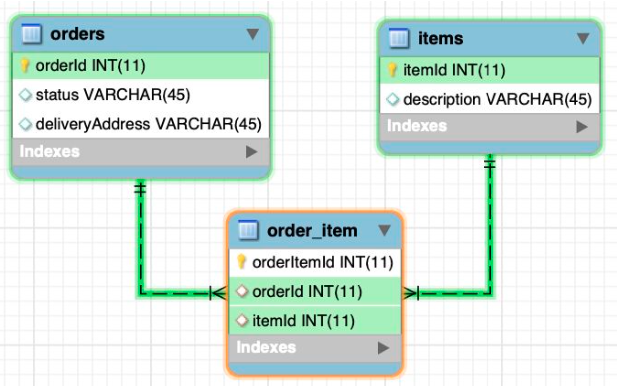

# Many-to-many

* Many-to-Many relationship occurs when multiple records in one table are associated with multiple records in another table.
* In order to model this you can break the many-to-many relationship into two one-to-many relationships by using a third table, called a join table. Each record in a join table includes a match field that contains the value of the primary keys of the two tables it joins (in the join table, these match fields are foreign keys). These foreign key fields are populated with data as records in the join table are created from either table it joins.

