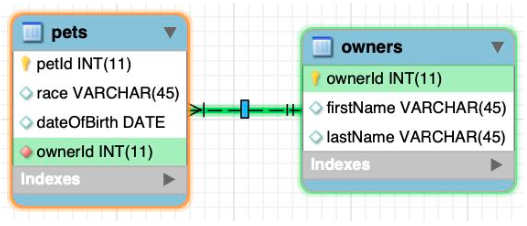

# One-to-many

* One-to-Many relationship is defined as a relationship between two tables where a row from one table can have multiple matching rows in another table.
* In order to model this you need to identify the table representing the many side of the relationship and add an additional column with a foreign key referencing the primary key of the table representing the one side of the relationship.

