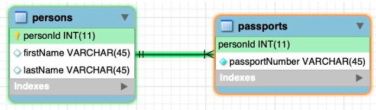

# One-to-one

* One-to-One relationships occur when there is only one record in the first table that corresponds to only one record in the related table.
* This is achieved by adding a foreign key from the primary key in the first table to the primary key in the second table.

