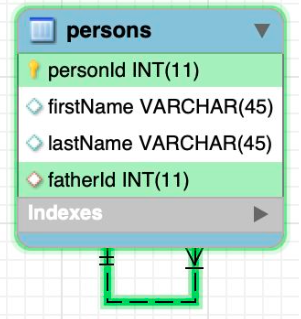

# Self-referecing

* Self-referencing is a relationship that exists between the records within a table.
* A table bears a self-referencing relationship (also known as a recursive relationship) to itself when a given record in the table is related to another record within the table.
* In order to model this you need to add an additional column with a foreign key referencing the primary key of the same
table.

